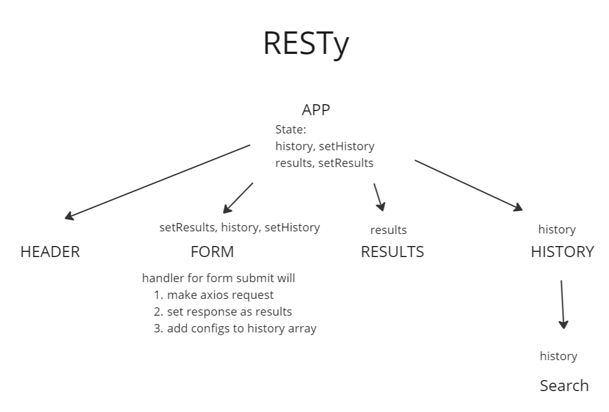

# RESTy

## Overview
This project shows results from making requests to a specified endpoint. You can add an endpoint to the text input and choose the method in the select box next to it. Hitting submit will show the results in the container below. A search history is recorded in the left sidebar.

## UML

## Available Scripts

In the project directory, you can run:

### `npm start`

Runs the app in the development mode.\
Open [http://localhost:3000](http://localhost:3000) to view it in your browser.

The page will reload when you make changes.\
You may also see any lint errors in the console.

### `npm test`

Launches the test runner in the interactive watch mode.\
See the section about [running tests](https://facebook.github.io/create-react-app/docs/running-tests) for more information.

### `npm run build`

Builds the app for production to the `build` folder.\
It correctly bundles React in production mode and optimizes the build for the best performance.

The build is minified and the filenames include the hashes.\
Your app is ready to be deployed!

### Change Logs
oct-24-2022 @ 1015 - Add form, results, and history functional components and styling
oct-24-2022 @ 1227 - Make axios requests with info provided from form and show search history in sidebar

### Resource
[How to print JSON String in human readable format in JS](https://stackoverflow.com/questions/60785852/how-to-print-json-string-in-human-readable-format-in-js)
